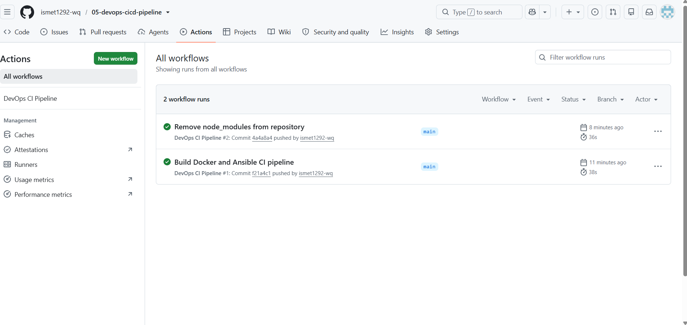
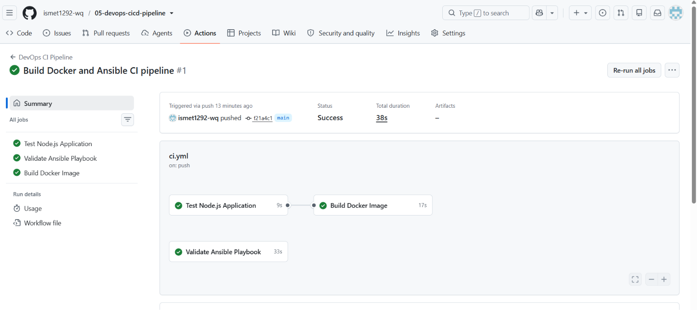
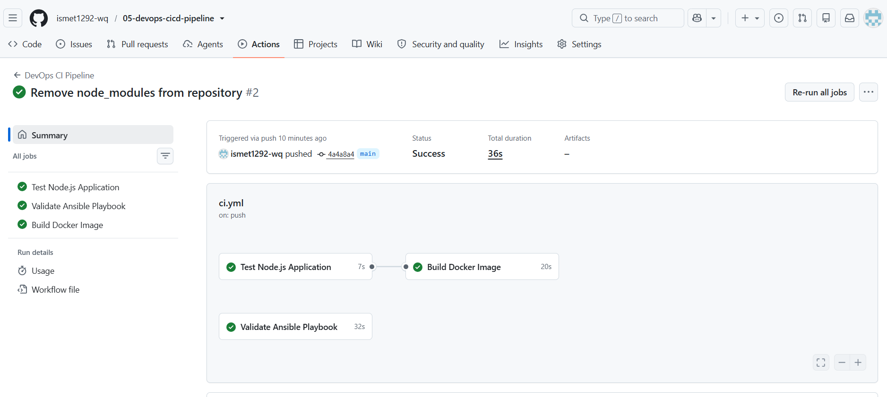

## Screenshots

### Workflow Runs

This screenshot shows successful GitHub Actions workflow executions after each push to the repository.

---

### Successful CI Pipeline

The CI pipeline successfully completed all stages, including application testing, Ansible playbook validation, and Docker image creation.

---

### Pipeline Details

This workflow demonstrates an automated DevOps pipeline that:

- ✅ Tests the Node.js application
- ✅ Validates the Ansible playbook
- ✅ Builds a Docker image
